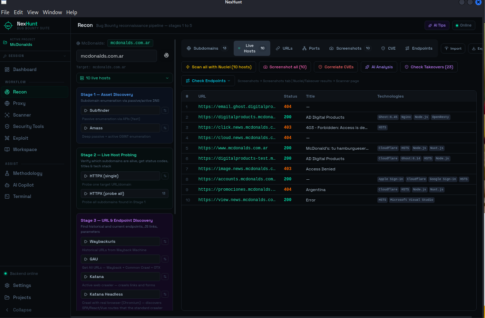
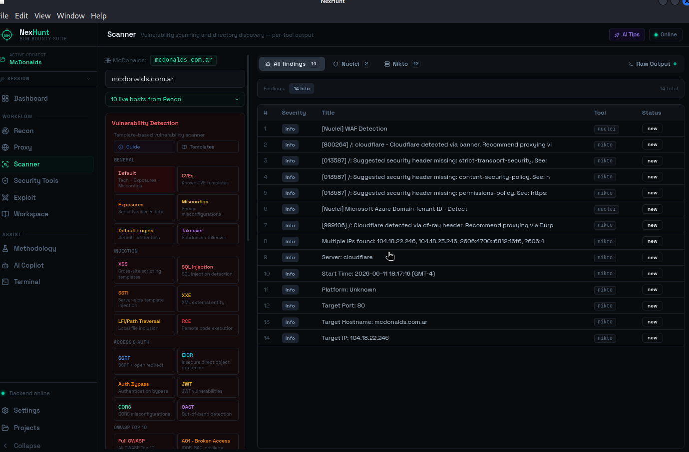
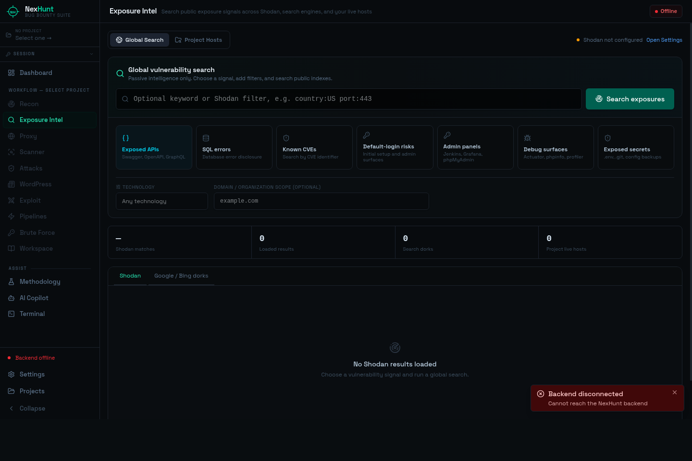

<div align="center">

```
███╗   ██╗███████╗██╗  ██╗██╗  ██╗██╗   ██╗███╗   ██╗████████╗
████╗  ██║██╔════╝╚██╗██╔╝██║  ██║██║   ██║████╗  ██║╚══██╔══╝
██╔██╗ ██║█████╗   ╚███╔╝ ███████║██║   ██║██╔██╗ ██║   ██║
██║╚██╗██║██╔══╝   ██╔██╗ ██╔══██║██║   ██║██║╚██╗██║   ██║
██║ ╚████║███████╗██╔╝ ██╗██║  ██║╚██████╔╝██║ ╚████║   ██║
╚═╝  ╚═══╝╚══════╝╚═╝  ╚═╝╚═╝  ╚═╝ ╚═════╝ ╚═╝  ╚═══╝   ╚═╝
```

**Plataforma de Automatización para Bug Bounty en Linux**

[](https://github.com/sentinelsec-org/nexhunt/releases)
[]()
[](https://nexhunt.myshopify.com/products/nexhunt-pro)
[](https://nexhunt.myshopify.com)

**[Descargar Gratis](https://github.com/sentinelsec-org/nexhunt/releases/latest)** · **[Obtener PRO](https://nexhunt.myshopify.com/products/nexhunt-pro)** · **[nexhunt.myshopify.com](https://nexhunt.myshopify.com)**

> ⚠️ **Versión Beta** — en desarrollo activo. Las funciones principales son estables. Mejoras y nuevas herramientas se publican regularmente.

> **Repositorio público de releases:** acá se publican instaladores, documentación y capturas. El código fuente se mantiene privado.

</div>

---

## Capturas de pantalla

| Recon | Scanner |
|---|---|
|  |  |

> Sesión real contra mcdonalds.com.ar. subfinder descubrió subdominios, httpx los sondeó en paralelo, nuclei + nikto corrieron contra todos los hosts activos.

---

## ¿Qué es NexHunt?

NexHunt es una **aplicación de escritorio para bug bounty hunters y pentesters** que reemplaza tu colección de pestañas de terminal, scripts y notas dispersas con un flujo de trabajo único e integrado.

Desde el momento en que creás un proyecto, NexHunt te guía a través de la superficie de ataque completa — desde el descubrimiento de subdominios hasta la explotación de hallazgos y la generación de reportes. La salida de cada herramienta alimenta automáticamente la siguiente fase. Encontrás más, más rápido.

Corre **localmente en tu máquina Linux**. Sin nube, sin datos enviados a ningún lado (excepto el AI Copilot PRO, que ruteá a través del proxy de Sentinel). Tus hallazgos son tuyos.

---

## 🗺️ El flujo completo, en una sola app

### 🌐 Exposure Intelligence



Busca señales de exposición pública sin salir de NexHunt, tanto globalmente como dentro de los live hosts de tus proyectos.

- **Buscador global** — Swagger/OpenAPI expuesto, errores SQL, CVEs conocidos, riesgo de logins por defecto, debug y configuraciones filtradas
- **Integración Shodan** — combina presets con tecnología, país, puerto, dominio, organización o filtros manuales
- **Google y Bing dorks** — se generan automáticamente y se abren en tu navegador, sin scrapear buscadores
- **Filtro tecnológico libre** — WordPress, nginx, Apache, Jenkins, Grafana, Kubernetes, Elasticsearch o cualquier producto
- **Modo Project Hosts** — prueba rutas de alto valor únicamente sobre live hosts guardados en el proyecto activo
- **Seguro por defecto** — el modo global es pasivo; NexHunt no prueba contraseñas ni explota sistemas indexados

### 🔍 Reconocimiento

El pipeline de recon más completo que podés correr con un solo clic.

- **Enumeración de subdominios** — subfinder + amass corriendo en paralelo, resultados mergeados y deduplicados automáticamente
- **Sondeo de hosts activos** — httpx identifica códigos de estado, tecnologías, títulos y fingerprints de respuesta en todos los hosts descubiertos
- **Escaneo avanzado de puertos** — perfiles Nmap rápido, estándar, TCP completo, UDP y vulnerabilidades NSE, con fingerprints estructurados de servicios/versiones, CPE, OS, scripts y traceroute
- **Crawling web** — katana y linkfinder extraen todos los endpoints, archivos JS y formularios de los targets activos
- **Historial de URLs** — gau + waybackurls traen años de URLs archivadas de Wayback Machine y Common Crawl
- **Descubrimiento de parámetros** — paramspider y arjun encuentran parámetros HTTP ocultos en todas las URLs recolectadas
- **Análisis de endpoints** — analiza los endpoints descubiertos buscando patrones interesantes, requisitos de autenticación y superficie de ataque potencial
- **Screenshots** — gowitness saca capturas automáticas de todos los hosts activos para triaje visual

> 💡 El modo **Full Recon** *(PRO)* encadena todo lo anterior en un pipeline que corre mientras vas a buscar un café. Cada etapa individual de recon sigue disponible en Gratis.

---

### 🎯 Escaneo de Vulnerabilidades

Encontrá lo que realmente es explotable, no solo lo detectable.

- **Nuclei** — 8.000+ templates de la comunidad cubriendo CVEs, malas configuraciones, exposiciones, credenciales por defecto y más. NexHunt precarga **presets OWASP Top 10** y permite escaneos dirigidos por stack tecnológico
- **Correlación de CVEs** — matchea automáticamente las tecnologías descubiertas (nginx, Apache, WordPress, Spring...) con CVEs conocidos y corre templates de nuclei específicos. Un clic por stack
- **Brute-force de directorios** — ffuf, gobuster y dirsearch con selección inteligente de wordlists según el servidor detectado
- **Auditoría de servidor web** — nikto detecta malas configuraciones, headers desactualizados y vulnerabilidades conocidas del servidor
- **API Scanner** *(PRO)* — apuntá a una URL de docs Swagger/OpenAPI y prueba cada endpoint y método, anónimo vs autenticado, marcando control de acceso roto por la diferencia de status code
- **Repository Intelligence** *(PRO)* — confirma un `/.git` expuesto, reconstruye el repositorio, busca secretos en claro tanto actuales como borrados del historial, identifica acceso a GitHub/GitLab/Bitbucket y convierte los servicios referenciados en assets de Recon

---

### 💥 Explotación

Validá hallazgos. Probá el impacto. Escribí mejores reportes.

- **SQLi** — sqlmap en parámetros descubiertos, maneja automáticamente evasión de WAF, scripts de tamper y enumeración de bases de datos
- **XSS** — dalfox (rápido y preciso) y xsstrike (análisis DOM profundo) en todos los endpoints recolectados
- **Inyección de comandos** — commix en formularios y parámetros con indicadores de command injection
- **SSRF / Open redirect** — testing con interactsh para vulnerabilidades out-of-band

---

### 🛡️ Herramientas de Seguridad

Chequeos especializados que la mayoría de los scanners pasan por alto.

- **CORS mal configurado** — testea reflexión de origin, exposición de credenciales y políticas wildcard en todos los hosts activos
- **Bypass de 403** — prueba 20+ técnicas de bypass (inyección de headers, normalización de paths, verb tampering) en endpoints prohibidos
- **Exposición de buckets cloud** *(PRO)* — descubre buckets S3, GCS y Azure Blob mal configurados asociados al target, con prueba opcional de write-takeover
- **Escaneo de secretos GitHub** — TruffleHog escanea los repositorios públicos de la org objetivo buscando credenciales filtradas, API keys y tokens
- **Interacciones OOB** — listener de interactsh para callbacks DNS/HTTP de puntos de inyección ciegos
- **JS API Mapper** *(PRO)* — convierte bundles JS en un mapa de ataque de API: framework, bases de API, rutas y una matriz de acceso anónimo/usuario/admin
- **GraphQL Auditor** *(PRO)* — explorador interactivo de schema y consola de queries con comparación autenticado-vs-anónimo, descubrimiento de operaciones, candidatos IDOR, error leaks e inventario de mutaciones

---

### 🔀 Proxy y Análisis de Tráfico

Tu navaja suiza HTTP, integrada al flujo.

- **Captura de tráfico en vivo** — interceptá e inspeccioná cada request desde tu browser a través del proxy de NexHunt
- **Editor de requests** — modificá y reproducí cualquier request capturado con control total de headers y body
- **HTTP Repeater** — guardá requests interesantes y reproducílos con modificaciones
- **Proxy Intruder** — fuzzing automatizado con modos cluster bomb y pitchfork, wordlists de payloads y filtrado de respuestas

---

### 🤖 AI Copilot *(PRO)*

Un asistente de IA enfocado en seguridad que realmente entiende tus hallazgos.

- **Análisis de hosts** — pegás un hostname y obtenés un desglose completo de la superficie de ataque: qué buscar, qué herramientas correr, qué vulnerabilidades son probables dado el stack tecnológico
- **Análisis de hallazgos** — describís un comportamiento y obtenés confirmación de severidad, camino de explotación y redacción del reporte
- **Sugerencias de ataque** — dados tus hosts activos y la tecnología descubierta, obtenés una lista priorizada de qué atacar primero
- **Generación de reportes** — convierte tus hallazgos en un reporte de vulnerabilidades profesional, listo para entregar
- **Chat libre** — preguntá cualquier cosa de seguridad, obtenés respuestas ancladas en el contexto de tu proyecto actual

El AI corre en la infraestructura hosteada de Sentinel. No necesitás tu propia API key — solo tu licencia PRO.

---

### ⚙️ Más funciones

- **Proyectos** — aislamiento completo. Hallazgos, datos de recon, notas y configuraciones están scoped por target
- **Base de datos de hallazgos** — almacenamiento estructurado de cada vulnerabilidad encontrada, con severidad, evidencia y estado
- **Metodología** — guía de metodología de pentesting integrada cubriendo todas las fases, técnicas de ataque y checklists
- **Workspace** — notas, wordlists personalizadas y datos de sesión por proyecto
- **Terminal integrada** — ejecutá comandos arbitrarios sin salir de la app
- **Gestión de sesión** — configurá cookies y headers extra globalmente para todos los requests del proxy
- **Auto-actualización** — NexHunt chequea nuevas releases y se actualiza con un clic

---

## 🆓 Gratis vs ⭐ PRO

El tier gratuito es genuinamente útil. Sin límites de tiempo, sin degradación de funciones, sin pantallas de molestia.

| Función | Gratis | PRO |
|---|:---:|:---:|
| Etapas individuales de recon (subfinder, amass, httpx, Nmap Advanced, katana, gau...) | ✅ | ✅ |
| Screenshots de todos los hosts (gowitness) | ✅ | ✅ |
| Scanner objetivo único (nuclei, ffuf, nikto, gobuster, dirsearch) | ✅ | ✅ |
| Correlación de CVEs por tecnología | ✅ | ✅ |
| Explotación objetivo único (sqlmap, dalfox, xsstrike, commix) | ✅ | ✅ |
| Herramientas de seguridad (CORS, bypass 403, secretos GitHub, archivos expuestos) | ✅ | ✅ |
| Proxy captura + editor + repeater | ✅ | ✅ |
| BD de hallazgos + proyectos + metodología | ✅ | ✅ |
| Terminal integrada + gestión de sesión | ✅ | ✅ |
| **Exposure Intelligence** (Shodan, dorks y endpoints del proyecto) | ❌ | ✅ |
| Suite WordPress + fuerza bruta de credenciales | ✅ | ✅ |
| VIEWSTATE Auditor | ✅ | ✅ |
| **GraphQL Auditor** (explorador de schema, comparación auth, IDOR y auditoría de operaciones) | ❌ | ✅ |
| Pipeline automatizado de XSS (Katana → minado JS → Dalfox) | ✅ | ✅ |
| **Pipeline de JS Secrets** | ❌ | ✅ |
| **AI Copilot** (análisis, sugerencias, generación de reportes) | ❌ | ✅ |
| **API Scanner** (prueba de endpoints OpenAPI/Swagger, anónimo vs autenticado) | ❌ | ✅ |
| **Repository Intelligence** (recuperación Git, secretos históricos, proveedores y arquitectura) | ❌ | ✅ |
| **Cloud buckets** (S3/GCS/Azure, prueba de write-takeover) | ❌ | ✅ |
| **JS API Mapper** (bundles JS → mapa de ataque de API) | ❌ | ✅ |
| **Pipeline automatizado de SQLi** (Katana → minado de JS → prueba en 3 capas) | ❌ | ✅ |
| **Escaneo masivo** (nuclei-bulk, recon completo en todos los hosts) | ❌ | ✅ |
| **Endpoint check** masivo en URLs descubiertas | ❌ | ✅ |
| Proxy Intruder (cluster bomb / pitchfork) | ✅ | ✅ |
| **Suite JWT** (confusión de algoritmos, inyección de keys, falsificación de claims) | ❌ | ✅ |
| Soporte prioritario | ❌ | ✅ |

**[→ Obtener PRO en nexhunt.myshopify.com](https://nexhunt.myshopify.com/products/nexhunt-pro)**

---

## ⚡ Instalación

### One-liner

```bash
curl -fsSL https://raw.githubusercontent.com/sentinelsec-org/nexhunt/main/install.sh | sudo bash
```

El instalador:
- Selecciona el paquete para la arquitectura de tu CPU y verifica su checksum SHA-256 publicado
- Instala las 20+ herramientas de seguridad (nmap, nuclei, subfinder, ffuf, sqlmap, dalfox, gowitness, katana, gau, waybackurls, gobuster, nikto, dirsearch, commix, arjun, paramspider, xsstrike, amass, httpx, interactsh...)
- Configura el backend Python en un venv aislado
- Construye el frontend Electron
- Agrega `nexhunt` a tu PATH
- Crea una entrada `.desktop` para tu lanzador de apps

### Requisitos

| Requisito | Notas |
|---|---|
| Linux | Kali, Debian, Ubuntu, Arch Linux y CachyOS — flujo compatible probado para Kali/CachyOS |
| CPU | x86-64 / amd64 |
| Python 3.10+ | Disponible en todas las distros soportadas |
| Node.js 18+ | Se instala automáticamente si no está |
| Go 1.24+ | Se instala automáticamente si falta o está desactualizado |
| ~2 GB disco | Para todas las herramientas + venv + build |
| Internet | Solo para la instalación inicial |

### Actualizar

```bash
sudo bash install.sh --update
```

O desde dentro de la app: **Ajustes → Actualizaciones → Buscar actualizaciones**.

---

## 🔑 Licencia PRO

1. Comprá en **[nexhunt.myshopify.com](https://nexhunt.myshopify.com/products/nexhunt-pro)**
2. Abrí NexHunt → **Ajustes → Licencia**
3. Pegá tu key → **Activar**

- La licencia está atada a tu máquina (fingerprint de hardware)
- Se valida online cada 24hs — funciona offline hasta 7 días
- Para transferir a una nueva máquina: desactivá primero, luego activá en la nueva
- Consultas: [nexhunt.myshopify.com](https://nexhunt.myshopify.com)

---

## 🛣️ Roadmap

- [ ] Exportación de reportes profesionales en PDF / HTML
- [ ] Templates nuclei premium y wordlists curadas (PRO)
- [ ] Soporte Windows
- [ ] Modo equipo / proyectos compartidos
- [ ] Escaneos automatizados programados
- [ ] Modo API para integración con CI/CD

¿Tenés una sugerencia? [Abrí un issue](https://github.com/sentinelsec-org/nexhunt/issues) — leemos todo.

---

## 🐛 Issues conocidos (beta)

- Targets muy grandes (1000+ subdominios) pueden ralentizar la UI durante el recon — estamos trabajando en paginación
- gowitness requiere servidor de display; entornos headless necesitan Xvfb
- amass es lento por diseño — usá subfinder para resultados más rápidos si el tiempo apremia

---

## 📄 Licencia

NexHunt es software propietario. El **tier gratuito** es libre de usar indefinidamente para trabajo de bug bounty personal y profesional. El **tier PRO** requiere una licencia paga. Ver [nexhunt.myshopify.com](https://nexhunt.myshopify.com) para términos.

---

<div align="center">

Hecho con 🖤 por **[Sentinel Security](https://nexhunt.myshopify.com)**

*NexHunt v1.6.0 beta — Linux*

</div>
