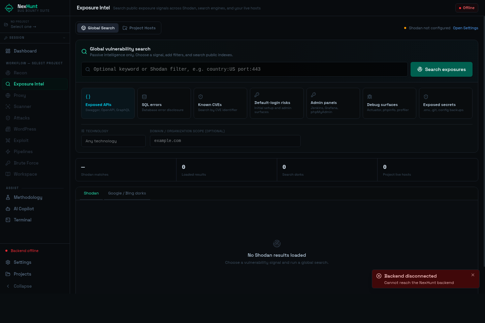
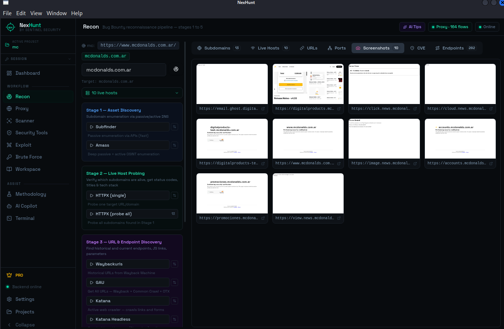
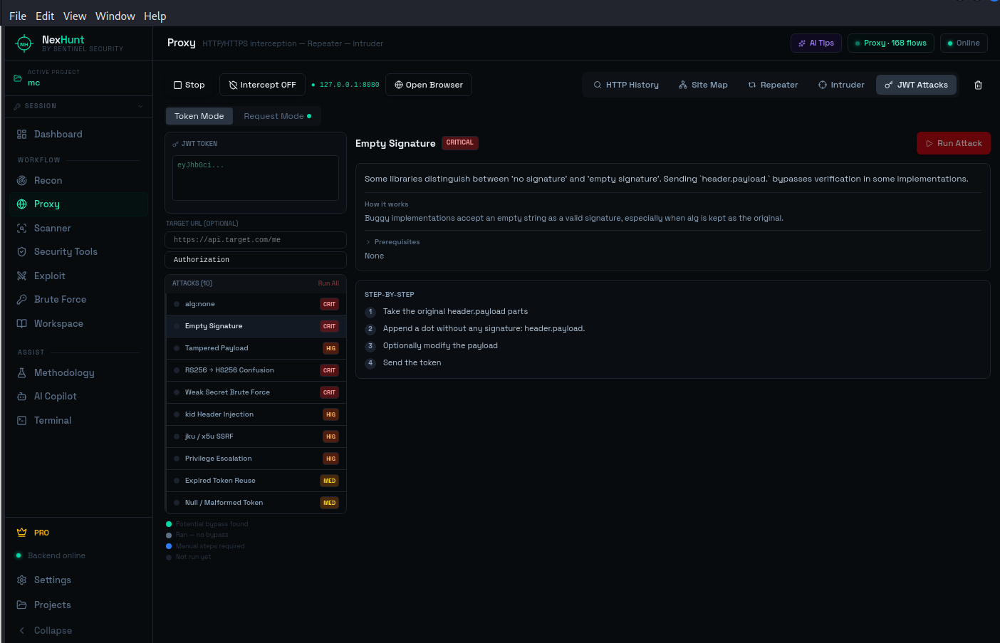
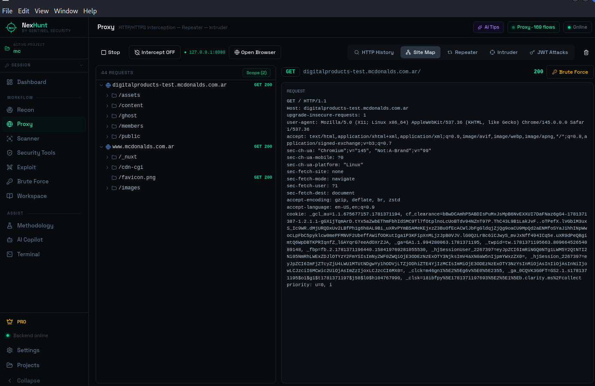

<div align="center">

```
███╗   ██╗███████╗██╗  ██╗██╗  ██╗██╗   ██╗███╗   ██╗████████╗
████╗  ██║██╔════╝╚██╗██╔╝██║  ██║██║   ██║████╗  ██║╚══██╔══╝
██╔██╗ ██║█████╗   ╚███╔╝ ███████║██║   ██║██╔██╗ ██║   ██║
██║╚██╗██║██╔══╝   ██╔██╗ ██╔══██║██║   ██║██║╚██╗██║   ██║
██║ ╚████║███████╗██╔╝ ██╗██║  ██║╚██████╔╝██║ ╚████║   ██║
╚═╝  ╚═══╝╚══════╝╚═╝  ╚═╝╚═╝  ╚═╝ ╚═════╝ ╚═╝  ╚═══╝   ╚═╝
```

**Bug Bounty Automation Platform for Linux**

[](https://github.com/sentinelsec-org/nexhunt/releases)
[]()
[](https://nexhunt.myshopify.com/products/nexhunt-pro)
[](https://nexhunt.myshopify.com)

**[Download Free](https://github.com/sentinelsec-org/nexhunt/releases/latest)** · **[Get PRO](https://nexhunt.myshopify.com/products/nexhunt-pro)** · **[nexhunt.myshopify.com](https://nexhunt.myshopify.com)**

> ⚠️ **Beta release** — actively developed. Core features are stable. New tools and improvements drop regularly.

> **Public release repository:** installers, documentation, and screenshots live here. Application source is maintained privately.

</div>

---

## What is NexHunt?

NexHunt is a **desktop app for bug bounty hunters and penetration testers** that replaces your messy collection of terminal tabs, scripts, and notes with a single, integrated workflow.

From the moment you create a project, NexHunt guides you through the full attack surface — from subdomain discovery all the way to exploiting findings and generating reports. Every tool's output feeds the next phase automatically. You find more, faster.

It runs **locally on your Linux machine**. No cloud, no data sent anywhere (except the PRO AI Copilot, which routes through Sentinel's privacy-respecting proxy). Your findings stay yours.

---

## 🗺️ The full workflow, in one app

### 🌐 Exposure Intelligence



Search public exposure signals without leaving NexHunt. Start globally, or pivot into the live hosts already stored in a project.

- **Global vulnerability search** — choose Swagger/OpenAPI exposure, SQL error disclosure, known CVEs, default-login risks, debug surfaces, or leaked configuration
- **Shodan integration** — combine presets with technology, country, port, domain, organization, or raw Shodan filters
- **Google and Bing dorks** — generated automatically and opened in your browser; no search-engine scraping
- **Technology filters** — WordPress, nginx, Apache, Jenkins, Grafana, Kubernetes, Elasticsearch, or any custom product string
- **Project host mode** — probe curated high-value paths only on live hosts already saved under the selected project
- **Safe by default** — global mode is passive; NexHunt never tries default passwords or exploits indexed systems

### 🔍 Reconnaissance



> Real session: subfinder enumerated subdomains on mcdonalds.com.ar, httpx probed all of them in parallel, gowitness screenshotted every live host automatically.

The most complete recon pipeline you can run from a single button.

- **Subdomain enumeration** — subfinder + amass running in parallel, results merged and deduplicated automatically
- **Live host probing** — httpx identifies status codes, technologies, titles, and response fingerprints across all discovered hosts
- **Advanced port scanning** — Nmap profiles for quick, standard, full TCP, UDP and NSE vulnerability scans, with structured service/version fingerprints, CPEs, OS matches, scripts and traceroute evidence
- **Web crawling** — katana and linkfinder extract every endpoint, JS file, and form from live targets
- **URL history** — gau + waybackurls pull years of archived URLs from Wayback Machine and Common Crawl
- **Parameter discovery** — paramspider and arjun find hidden HTTP parameters across all collected URLs
- **Endpoint analysis** — analyzes discovered endpoints for interesting patterns, auth requirements, and potential attack surface
- **Screenshots** — gowitness automatically screenshots every live host so you can triage visually

> 💡 The **Full Recon** mode *(PRO)* chains all of the above into one pipeline that runs while you grab a coffee. Every individual recon stage remains available in Free.

---

### 🎯 Vulnerability Scanning

Find what's actually exploitable, not just what's detectable.

- **Nuclei** — 8,000+ community templates covering CVEs, misconfigurations, exposures, default credentials, and more. NexHunt pre-loads **OWASP Top 10 presets** and lets you run targeted scans per technology
- **CVE Correlation** — automatically matches discovered technologies (nginx, Apache, WordPress, Spring...) to known CVEs and runs targeted nuclei templates. One click per tech stack
- **Directory brute-force** — ffuf, gobuster, and dirsearch with smart wordlist selection based on detected server type
- **Web server audit** — nikto catches misconfigurations, outdated headers, and known server vulnerabilities
- **API Scanner** *(PRO)* — point it at a Swagger/OpenAPI docs URL and it probes every endpoint and method, anonymous vs authenticated, flagging broken access control from the status-code delta
- **Repository Intelligence** *(PRO)* — confirms exposed `/.git`, reconstructs the repository, searches current and deleted history for cleartext secrets, identifies GitHub/GitLab/Bitbucket access, and turns referenced services into Recon assets

---

### 💥 Exploitation

Validate findings. Prove impact. Write better reports.

- **SQLi** — sqlmap on discovered parameters, automatically handles WAF evasion, tamper scripts, and DB enumeration
- **XSS** — dalfox (fast, accurate) and xsstrike (deep DOM analysis) on all collected endpoints
- **Command injection** — commix on forms and parameters with command injection indicators
- **SSRF / Open redirect** — interactsh-backed testing for out-of-band vulnerabilities
- **JWT attack suite** *(PRO)* — 10 attacks (alg:none, empty signature, RS256→HS256 confusion, weak secret brute force, kid header injection, jku/x5u SSRF, privilege escalation, and more) with step-by-step guidance per attack



---

### 🛡️ Security Tools

Specialized checks that most scanners miss.

- **CORS misconfiguration** — tests origin reflection, credential exposure, and wildcard policies across all live hosts
- **403 Bypass** — tries 20+ bypass techniques (header injection, path normalization, verb tampering) on forbidden endpoints
- **Cloud bucket exposure** *(PRO)* — discovers misconfigured S3, GCS, and Azure Blob buckets associated with the target, with an opt-in write-takeover proof
- **GitHub secret scanning** — TruffleHog scans the target org's public repositories for leaked credentials, API keys, and tokens
- **OOB interaction** — interactsh listener for DNS/HTTP callbacks from blind injection points
- **JS API Mapper** *(PRO)* — turns JS bundles into an API attack map: framework, API bases, routes, and an anon/user/admin access matrix
- **GraphQL Auditor** *(PRO)* — interactive schema explorer and query console with authenticated-vs-anonymous comparison, operation discovery, IDOR candidates, error leaks and mutation inventory

---

### 🔀 Proxy & Traffic Analysis

Your HTTP Swiss knife, built into the workflow.

- **Live traffic capture** — intercept and inspect every request from your browser through NexHunt's proxy
- **Request editor** — modify and replay any captured request with full header and body control
- **HTTP Repeater** — save interesting requests and replay with modifications
- **Site Map** — Burp-style host/path tree built automatically from captured traffic
- **Proxy Intruder** — automated fuzzing with cluster bomb and pitchfork attack modes, payload wordlists, and response filtering



---

### 🕶️ Privacy Route

Choose how NexHunt reaches authorized targets without disrupting its local intercepting proxy.

- **System VPN** — use Proton VPN, WARP, WireGuard, or OpenVPN for the best speed and broadest protocol coverage
- **Managed Tor** — NexHunt starts an isolated local Tor client and routes internal HTTP plus compatible CLI TCP traffic through it
- **Custom route** — use an authenticated SOCKS5, SOCKS4, or HTTP proxy
- **Exit verification** — compare the direct and routed addresses and verify Tor exits against the Tor Project service
- **Local bypass** — `localhost`, `127.0.0.1`, and `::1` always stay direct so Electron, the backend, and NexHunt Proxy continue working

SOCKS/Tor cannot anonymize raw SYN/UDP scans, ICMP, or every out-of-band callback. Use a system VPN when those protocols must also leave through another address.

---

### 🤖 AI Copilot *(PRO)*

A security-focused AI assistant that actually understands your findings.

- **Host analysis** — paste a hostname, get a full attack surface breakdown: what to look for, what tools to run, what vulnerabilities are likely given the tech stack
- **Finding analysis** — describe a behavior and get confirmation on severity, exploitation path, and report wording
- **Attack suggestions** — given your live hosts and discovered tech, get a prioritized list of what to attack next
- **Report generation** — turns your findings into a professional vulnerability report, ready to submit
- **Free-form chat** — ask anything security-related, get answers grounded in your current project context

The AI runs on Sentinel's hosted infrastructure. Your Groq/LLM API key is never needed — just your PRO license.

---

### ⚙️ More features

- **Projects** — full project isolation. Findings, recon data, notes, and settings are scoped per target
- **Findings database** — structured storage for every vulnerability found, with severity, evidence, and status tracking
- **Methodology** — built-in pentest methodology guide covering all phases, attack techniques, and checklists
- **Workspace** — notes, custom wordlists, and session data per project
- **Built-in terminal** — run arbitrary commands without leaving the app
- **Session management** — set cookies and extra headers globally for all requests through the proxy
- **Auto-update** — NexHunt checks for new releases and updates itself with one click

---

## 🆓 Free vs ⭐ PRO

The free tier is genuinely useful. No time limits, no feature degradation, no nag screens.

| Feature | Free | PRO |
|---|:---:|:---:|
| Individual recon stages (subfinder, amass, httpx, Nmap Advanced, katana, gau...) | ✅ | ✅ |
| Screenshot all hosts (gowitness) | ✅ | ✅ |
| Single-target scanner (nuclei, ffuf, nikto, gobuster, dirsearch) | ✅ | ✅ |
| CVE correlation per technology | ✅ | ✅ |
| Single-target exploitation (sqlmap, dalfox, xsstrike, commix) | ✅ | ✅ |
| Security tools (CORS, 403 bypass, GitHub secrets, exposed files) | ✅ | ✅ |
| Proxy capture + request editor + repeater | ✅ | ✅ |
| Privacy Route (system VPN, Tor, custom SOCKS/HTTP) | ✅ | ✅ |
| Findings database + projects + methodology | ✅ | ✅ |
| Built-in terminal + session management | ✅ | ✅ |
| **Exposure Intelligence** (Shodan, dorks, scoped endpoint discovery) | ❌ | ✅ |
| WordPress pentest suite + credential brute force | ✅ | ✅ |
| VIEWSTATE Auditor | ✅ | ✅ |
| **GraphQL Auditor** (schema explorer, auth comparison, IDOR and operation audit) | ❌ | ✅ |
| Automated XSS pipeline (Katana → mine JS → Dalfox) | ✅ | ✅ |
| **JS Secrets pipeline** | ❌ | ✅ |
| **AI Copilot** (analysis, tips, report generation) | ❌ | ✅ |
| **API Scanner** (OpenAPI/Swagger endpoint probing, anon vs authed) | ❌ | ✅ |
| **Repository Intelligence** (Git recovery, history secrets, providers, architecture) | ❌ | ✅ |
| **Cloud bucket exposure** (S3/GCS/Azure, write-takeover proof) | ❌ | ✅ |
| **JS API Mapper** (JS bundles → API attack map) | ❌ | ✅ |
| **Automated SQLi pipeline** (Katana → mine JS → 3-layer probe) | ❌ | ✅ |
| **Bulk scanning** (nuclei-bulk, full recon on all hosts) | ❌ | ✅ |
| **Endpoint check** across all discovered URLs | ❌ | ✅ |
| Proxy Intruder (cluster bomb / pitchfork) | ✅ | ✅ |
| **JWT attack suite** (algorithm confusion, key injection, claim forgery) | ❌ | ✅ |
| Priority support | ❌ | ✅ |

**[→ Get PRO at nexhunt.myshopify.com](https://nexhunt.myshopify.com/products/nexhunt-pro)**

---

## ⚡ Installation

### One-liner

```bash
curl -fsSL https://raw.githubusercontent.com/sentinelsec-org/nexhunt/main/install.sh | sudo bash
```

The installer:
- Selects the package for your CPU architecture and verifies its published SHA-256 checksum
- Installs all 20+ security tools (nmap, nuclei, subfinder, ffuf, sqlmap, dalfox, gowitness, katana, gau, waybackurls, gobuster, nikto, dirsearch, commix, arjun, paramspider, xsstrike, amass, httpx, interactsh, TruffleHog, git-dumper...)
- Sets up the Python backend in an isolated venv
- Builds the Electron frontend
- Adds `nexhunt` to your PATH
- Creates a `.desktop` entry for your app launcher

### Requirements

| Requirement | Notes |
|---|---|
| Linux | Kali, Debian, Ubuntu, Arch Linux, CachyOS — tested on Kali and CachyOS-compatible flow |
| CPU | x86-64 / amd64 |
| Python 3.10+ | Available on all supported distros |
| Node.js 18+ | Installed automatically if missing |
| Go 1.24+ | Installed automatically if missing or outdated |
| ~2 GB disk | For all tools + venv + build |
| Internet | For initial install only |

### Update

```bash
sudo bash install.sh --update
```

Or from inside the app: **Settings → Updates → Check for updates**.

---

## 🔑 PRO License

1. Purchase at **[nexhunt.myshopify.com](https://nexhunt.myshopify.com/products/nexhunt-pro)**
2. Open NexHunt → **Settings → License**
3. Paste your key → **Activate**

- License is bound to your machine (hardware fingerprint)
- Validates online every 24h — works offline for up to 7 days
- Transfer to a new machine: deactivate first, then activate on the new one
- Questions: reach us at [nexhunt.myshopify.com](https://nexhunt.myshopify.com)

---

## 🛣️ Roadmap

- [ ] PDF / HTML professional report export
- [ ] Premium nuclei templates and custom wordlists (PRO)
- [ ] Windows support
- [ ] Team/shared project mode
- [ ] Scheduled automated scans
- [ ] API mode for CI/CD integration

Have a feature request? [Open an issue](https://github.com/sentinelsec-org/nexhunt/issues) — we read everything.

---

## 🐛 Known issues (beta)

- Very large targets (1000+ subdomains) may slow down the UI during recon — we're working on pagination
- gowitness requires a display server; headless environments need Xvfb
- amass is slow by design — use subfinder for faster results if time is tight

---

## 📄 License

NexHunt is proprietary software. The **free tier** is free to use indefinitely for personal and professional bug bounty work. The **PRO tier** requires a paid license. See [nexhunt.myshopify.com](https://nexhunt.myshopify.com) for terms.

---

<div align="center">

Built with 🖤 by **[Sentinel Security](https://nexhunt.myshopify.com)**

*NexHunt v1.2.1 beta — Linux*

</div>
